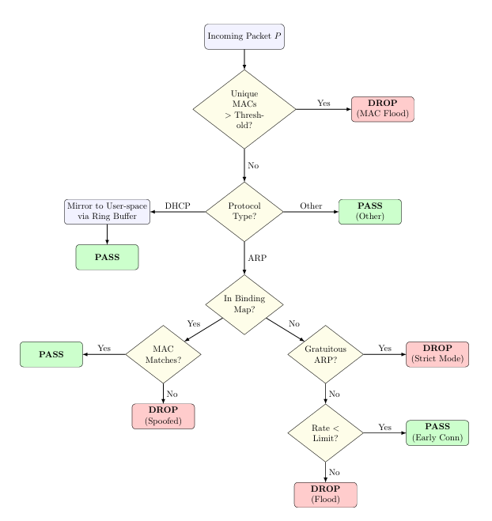

# XDP-Based Layer-2 Security System

Layer-2 attacks such as ARP Spoofing and MAC Flooding can compromise Local Area Networks by manipulating IP-MAC bindings and disrupting normal packet forwarding. This project implements a lightweight security framework using XDP and eBPF to detect and mitigate these attacks at the earliest point in the Linux networking stack.

This guide is tailored for running the solution on a physical Linux server/switch acting as a layer-2 bridge, rather than a virtualized Proxmox environment.

```
                            INTERNET / MANAGEMENT NETWORK
                                       │
                                       │ (Management access, out-of-band)
                                       ▼
  ┌───────────────────────────────── eth0 ─────────────────────────────────┐
  │                                                                        │
  │                      PHYSICAL LINUX HOST (Switch)                      │
  │                                                                        │
  │    ┌────────────────────────────┐      ┌────────────────────────────┐  │
  │    │ XDP Program (Native Mode)  │      │ User-Space Daemon          │  │
  │    │ ● MAC Flood Detection      │      │ (arp_guard)                │  │
  │    │ ● DHCP Snooping            │◄────►│ (Ring Buffer → Binding Map)│  │
  │    │ ● ARP Spoofing Mitigation  │      │                            │  │
  │    │ ● Gratuitous ARP Blocking  │      └────────────────────────────┘  │
  │    └────────────────────────────┘                                      │
  │                  ▲                                                     │
  │                  │ XDP inspects every packet on bridged ports          │
  │                  ▼                                                     │
  │  ┌────────── Linux Bridge (br0) ────────────────────────────────────┐  │
  │  │                                                                  │  │
  └──┴── eth1 ─────────── eth2 ─────────── eth3 ─────────── eth4 ───────┴──┘
          │                │                │                │
          │                │                │                │
     Physical Link    Physical Link    Physical Link    Physical Link
          │                │                │                │
          ▼                ▼                ▼                ▼
     ┌────────┐       ┌────────┐       ┌────────┐       ┌────────┐
     │  Host  │       │  Host  │       │  DHCP  │       │ Rogue  │
     │ Client │       │ Client │       │ Server │       │ Device │
     └────────┘       └────────┘       └────────┘       └────────┘
```

The physical host bridges multiple physical Ethernet interfaces (e.g., `eth1`, `eth2`, `eth3`). The management interface (`eth0`) is kept completely separate from the bridge to prevent accidental lockouts.

## Features

- **MAC Flooding Protection** - Tracks unique source MACs in an LRU map. Drops packets immediately if the count exceeds `FLOOD_THRESHOLD`.
- **Protocol Demultiplexing** - DHCP packets are mirrored to user-space; ARP packets are sent for validation; other traffic passes through.
- **ARP Validation** - Validates ARP against trusted `binding_map[sender_IP]`. Drops spoofed ARP packets.
- **Gratuitous ARP Blocking** - Drops GARP (sender IP == target IP) to prevent MITM vectors without binding.
- **Rate-limited Acceptance** - Allows initial DHCP window by rate-limiting regular ARP packets.
- **DHCP Snooping** - User-space daemon parses DHCP ACK and dynamically updates the eBPF binding map.

## Prerequisites

- Linux machine (Ubuntu/Debian recommended) with multiple physical network interfaces.
- NIC drivers supporting **Native XDP** (e.g., `ixgbe`, `i40e`, `mlx5_core`, `igb`).
- Linux kernel 5.x+
- Clang, LLVM, `bpftool`, `libbpf-dev`, and linux-headers

```bash
# Debian / Ubuntu
sudo apt-get update && sudo apt-get install -y clang llvm libelf-dev libbpf-dev bpfcc-tools linux-headers-$(uname -r) build-essential bridge-utils
```
## Detection Workflow

The framework processes packets at the XDP layer and applies a series of validation checks to detect and mitigate Layer-2 attacks before packets enter the Linux networking stack.

### Workflow Diagram



### 1. MAC Flood Detection

The XDP program tracks unique source MAC addresses observed on the network. If the number of unique MAC addresses exceeds a predefined threshold, the packet is classified as part of a MAC flooding attack and is immediately dropped.

**Action:** `DROP (MAC Flood)`

---

### 2. DHCP Snooping

DHCP packets are mirrored to the user-space daemon through a ring buffer. The daemon extracts legitimate IP-MAC assignments and updates the eBPF binding table.

This dynamically learned binding information is later used to validate ARP traffic.

**Action:** `PASS + Learn Binding`

---

### 3. ARP Validation

For ARP packets, the sender IP address is looked up in the IP-MAC binding table maintained in eBPF maps.

- If the binding exists and the MAC address matches the stored entry, the packet is considered legitimate.
- If the MAC address differs from the stored binding, the packet is identified as an ARP spoofing attempt.

**Actions:**
- Valid Binding → `PASS`
- Binding Mismatch → `DROP (ARP Spoofing)`

---

### 4. Gratuitous ARP Handling

If an ARP packet does not correspond to a known binding, the framework checks whether it is a Gratuitous ARP advertisement.

In strict enforcement mode, unsolicited Gratuitous ARP packets are rejected to prevent unauthorized updates to IP-MAC mappings.

**Action:** `DROP (Strict Mode)`

---

### 5. Flood Prevention

For previously unseen hosts, the framework allows a limited number of ARP packets during the initial learning phase.

A rate limiter is applied to prevent attackers from generating excessive ARP traffic.

- Packets within the configured limit are accepted.
- Packets exceeding the limit are classified as ARP flooding attempts.

**Actions:**
- Within Rate Limit → `PASS (Early Connection)`
- Rate Limit Exceeded → `DROP (Flood)`

---

### Decision Summary

| Condition | Action |
|------------|----------|
| Unique MAC count exceeds threshold | DROP (MAC Flood) |
| DHCP packet | PASS + Mirror to User Space |
| Non-ARP traffic | PASS |
| Valid IP-MAC binding | PASS |
| Binding mismatch | DROP (ARP Spoofing) |
| Gratuitous ARP in strict mode | DROP |
| Unknown ARP within rate limit | PASS |
| Unknown ARP exceeding rate limit | DROP (Flood) |

## Build

### 1. Clone the repository
```bash
git clone https://github.com/Vidith-Murthy/Mitigating-Layer-2-Attacks-Using-Native-XDP.git
```
### 2. Navigate to the scr directory
```bash
cd Mitigating-Layer-2-Attacks-Using-Native-XDP/src
```
### 3. Generate vmlinux.h and compile the BPF program and daemon
```bash
make vmlinux
make
```
The build produces the daemon binary: `build/arp_guard`.

## Quick Start

### 1. Configure the Physical Linux Bridge

Identify the physical network interfaces you want to bridge (e.g., `eth1`, `eth2`, `eth3`). Use the provided script to set up the bridge and disable offloads that interfere with XDP.

> **WARNING**: Do NOT add the management interface (e.g., `eth0`) to the bridge as it might lead to losing SSH  access.

```bash
# Provide the physical interfaces as arguments
sudo ../scripts/setup_bridge.sh eth1 eth2 eth3
```

### 2. Connect Devices

- Connect a physical DHCP server to `eth3` (or any bridged port).
- Connect physical clients to `eth1` and `eth2`.
- Ensure devices can communicate across the bridge.

### 3. Start the XDP Security Daemon

Attach the compiled XDP program to your physical switch ports by running the `arp_guard` daemon:

```bash
sudo ./build/arp_guard \
    --iface eth1 \
    --iface eth2 \
    --iface eth3 \
    --verbose
```

### 4. Verify the Security Enforcement

Check the daemon logs. You should see successful attachments:

```
✓ XDP attached to eth1 (native/driver mode)
✓ XDP attached to eth2 (native/driver mode)
✓ XDP attached to eth3 (native/driver mode)
```

## CLI Reference

### arp_guard

```
arp_guard [--iface name] [--static-binding ip mac] [--list-bindings] 
          [--stats] [--add-binding ip mac] [--del-binding ip] 
          [--flood-threshold n] [--rate-limit n] [--verbose] [--help]
```

| Flag | Default | Description |
|---|---|---|
| `--iface` | *(none)* | Interface to attach XDP (repeatable) |
| `--static-binding` | *(none)* | Pre-load a binding at startup (repeatable) |
| `--list-bindings` | *(none)* | List current IP→MAC bindings and exit |
| `--stats` | *(none)* | Show statistics and exit |
| `--add-binding` | *(none)* | Manually add a binding and exit |
| `--del-binding` | *(none)* | Remove a binding and exit |
| `--flood-threshold` | `100` | Set flood threshold |
| `--rate-limit` | `5` | Set ARP rate limit |
| `--verbose` | *(none)* | Enable verbose logging |
| `--help` | *(none)* | Show help menu |

## Configuration

Compile-time thresholds can be overridden when building:

```bash
make FLOOD_THRESHOLD=200 RATE_LIMIT=10
```

## Repository Layout

```
build/
├── arp_guard                   User-space control daemon executable
├── arp_guard.bpf.o             Compiled XDP/eBPF program object
├── arp_guard.skel.h            Generated libbpf skeleton header
scripts/
├── benchmark_attack.sh         Simulate attacks and measure performance
├── setup_bridge.sh             Configure Linux host as an L2 bridge
├── setup_dhcp_server.sh        Configure DHCP server
src/
├── arp_guard.h                 Shared header (maps, constants, structs)
├── arp_guard.bpf.c             XDP kernel program
├── arp_guardd.c                User-space daemon
├── Makefile                    Build system
```

## eBPF Maps

| Map | Type | Key | Value | Purpose |
|---|---|---|---|---|
| `binding_map` | HASH | IPv4 addr | MAC addr | Trusted IP→MAC from DHCP |
| `mac_tracking_map` | LRU_HASH | MAC addr | Timestamp | Unknown MAC tracking |
| `mac_count_map` | ARRAY | `0` | Counter | Unique unknown MAC count |
| `rate_limit_map` | LRU_HASH | IPv4 addr | Counter | Per-IP ARP rate limiting |
| `stats_map` | PERCPU_ARRAY | Stat index | Counter | Performance counters |
| `events_rb` | RINGBUF | *(none)* | Packet data | DHCP packet mirroring |

## Troubleshooting

### Checking Native XDP Support
Not all physical NICs support "Native" XDP (driver mode). To check your driver:
```bash
ethtool -i eth1 | grep driver
```
If your NIC does not support Native XDP, the daemon will automatically attempt to fall back to **SKB mode** (Generic XDP).

### Removing Stale XDP Programs
If the daemon crashes and leaves the XDP program attached:
```bash
ip -details link show eth1
sudo ip link set dev eth1 xdp off
```

### Verifying Ring Buffer Traffic
If bindings aren't updating, verify DHCP packets are actually passing through the switch hardware:
```bash
sudo tcpdump -i br0 port 67 or port 68 -vv
```

## License

GPL-2.0
